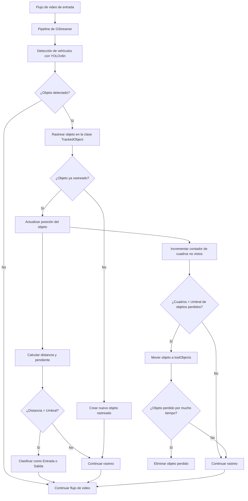

<div style="text-align: center;">
  
</div>
</br>


# Proyecto Integrador Equipo 20 

Este repositorio contiene el desarrollo de nuestro proyecto sobre un fork del repositorio de ejemplos de Hailo, sigue la estructura del repositorio base de Hailo, y contiene nuestros entregables.

## Integrantes

- A01794188 - Francisco Xavier Bastidas Moreno 
- A01794653 - Raúl Jesús Coronado Aguirre 
- A01794327 - Juan Sebastián Ortega Briones

##  Indice

 1. [Avance 0 ](./Avance0%23Equipo20.pdf)
 2. [Avance 1 ](./Avance1%23Equipo20.pdf)
 3. [Avance 2 ](./Avance2%23Equipo20.pdf)
 4. [Avance 3 ](./Avance3%23Equipo20.pdf)
 5. [Avance 4 ](./Avance4%23Equipo20.pdf)

## [Código](basic_pipelines/desde_cero.py)

## Evidencia en video
[Avance 2 - Demostración de características ](https://moviltrack-my.sharepoint.com/:v:/p/sortega/EeXvsAuP1EdCpmZFKprT2W4BSHTL0buqXMhEXWPkI3lIXg?e=FWLSc2)

[Avance 2 - Demostración de características RFID ](https://moviltrack-my.sharepoint.com/:v:/p/sortega/EfbZp_YvPrVJix2TYqhsI_ABCpYehQcC08gok_1Glbu7cg?e=sV9mKa)


[Avance 3 - Baseline](https://moviltrack-my.sharepoint.com/:v:/p/sortega/EeXvsAuP1EdCpmZFKprT2W4BSHTL0buqXMhEXWPkI3lIXg?e=FWLSc2)


## Utilidades para el desarrollo del proyecto

Para generar las regiones de interés en las imágenes, se utilizó la herramienta MAkeSens.ai, la cual permite generar las regiones de interés de manera sencilla y exportarlas en formato JSON.
https://www.makesense.ai/

Para Pruebas, hicimos edición de video para recortar los tiempos donde no hay nada y no tener que esperar tanto tiempo para probar el código. Para esto utilizamos la herramienta OpenShot, que es un editor de video de código abierto y multiplataforma.
https://www.openshot.org/es/


# Ejecución del código
````
python basic_pipelines/desde_cero.py --video-file /media/pi/KINGSTON/recordings/Ultima_posicion/recording_20240928_133154.mp4 --use-frame
````

La opción **--use-frame** permite visualizar el video en tiempo real, si no se coloca esta opción, Sin presentar el video con todas las características que estamos calculando, Sin embargo, si se Presenta el video con todas las detecciones y las estadísticas. 

### Notas
El video Que estamos utilizando los seleccionamos, porque tiene muchas características que nos permiten probar el código como vehículos estáticos distracciones, más de un vehículo en la imagen vehículos, que circulan lento y vehículos que circulan muy rápido. 
Dentro de nuestro repositorio de datos, este es este es el archivo del video que estamos ocupando:
recording_20240928_133154.mp4

En la Raspberry lo tenemos conectado a una memoria externa, por lo que la ruta de acceso es 
```/media/pi/KINGSTON/recordings/Ultima_posicion/recording_20240928_133154.mp4```

Como referencia para pruebas externas a la Raspberry Se puede descargar de esta ruta: 

https://moviltrack-my.sharepoint.com/:v:/p/sortega/EQkRa5qF7D1OvWKATfq312cBnhCv5WW2wY5GorRyY4Yqrg?e=gs6UoY

### Diagrama de flujo




